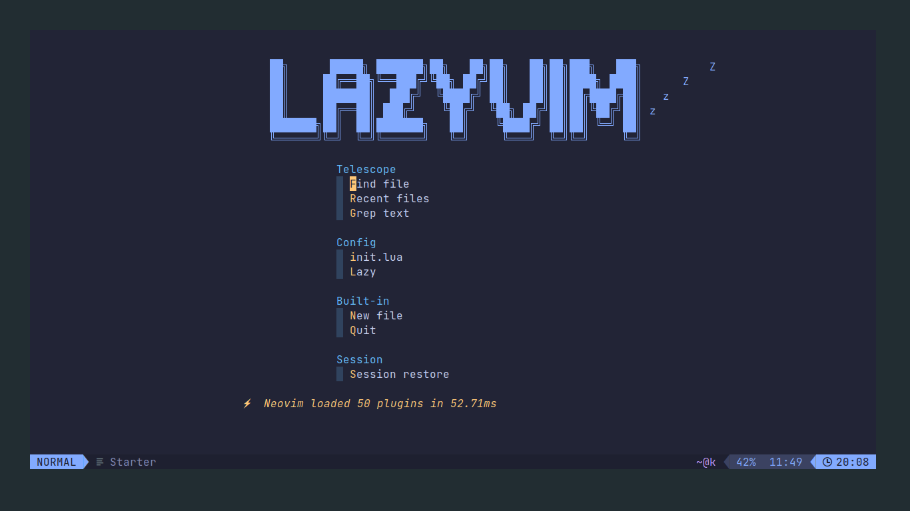
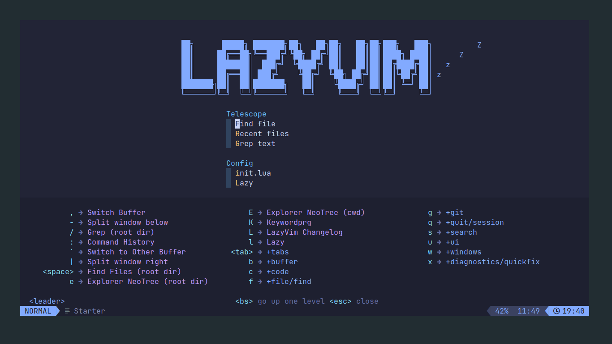
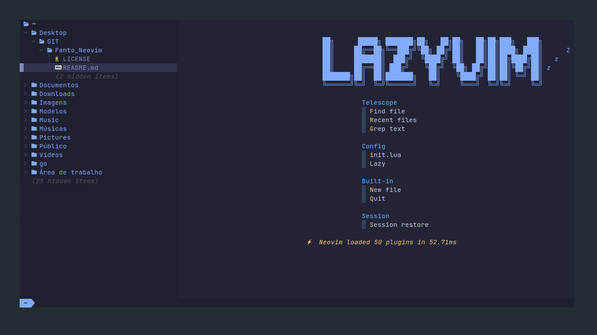
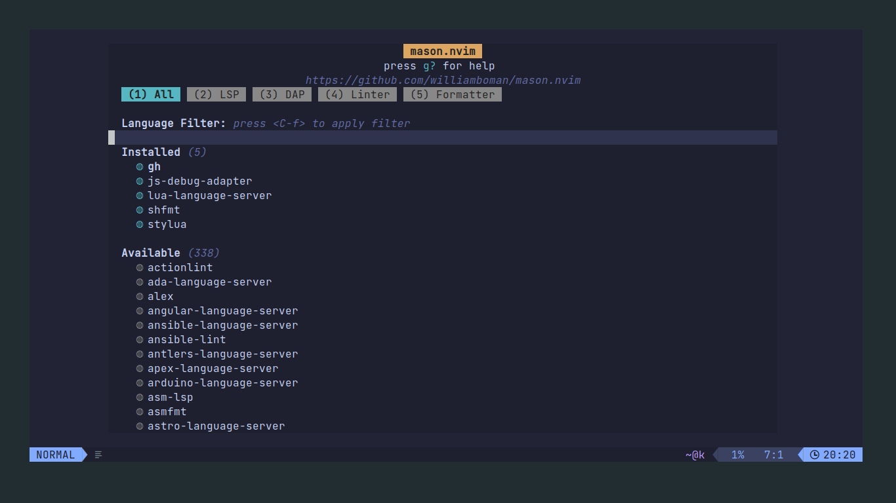
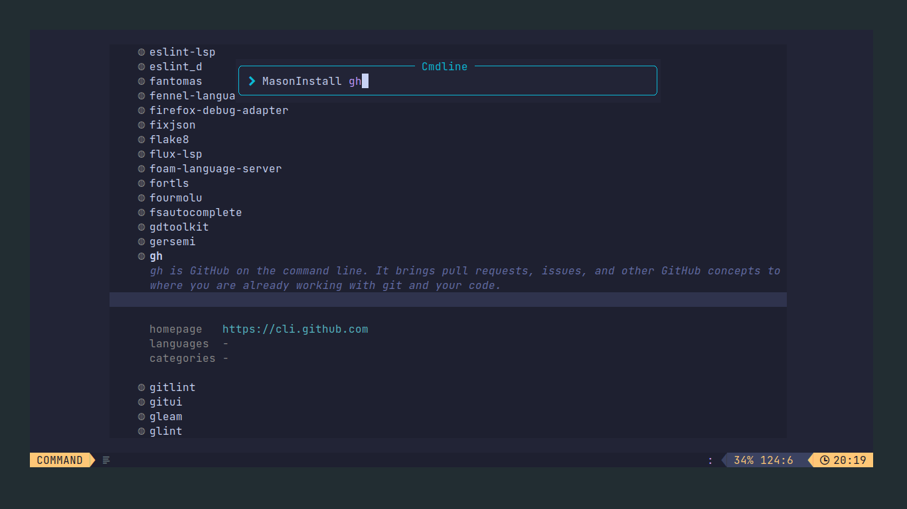
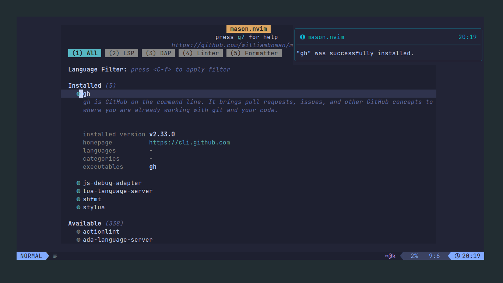
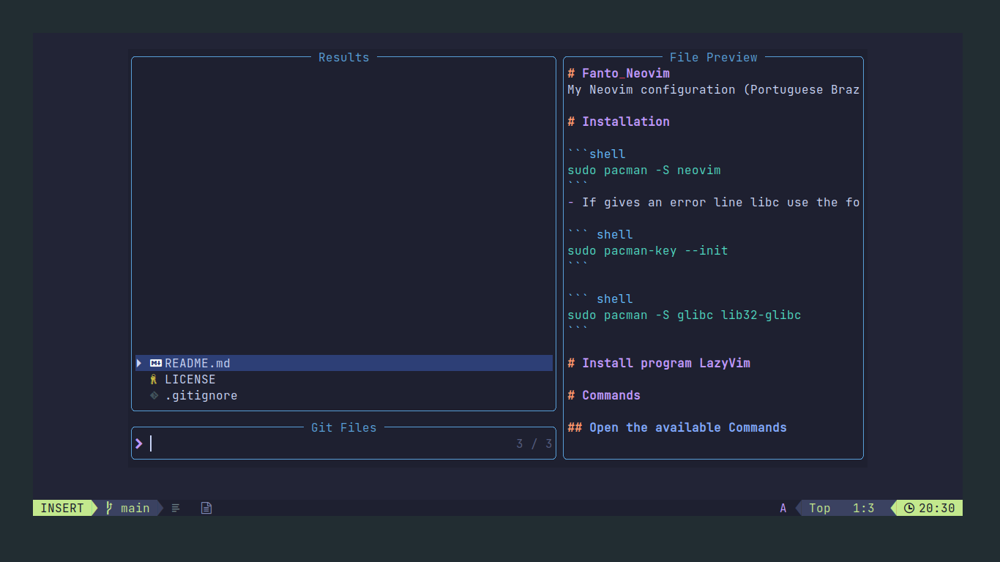
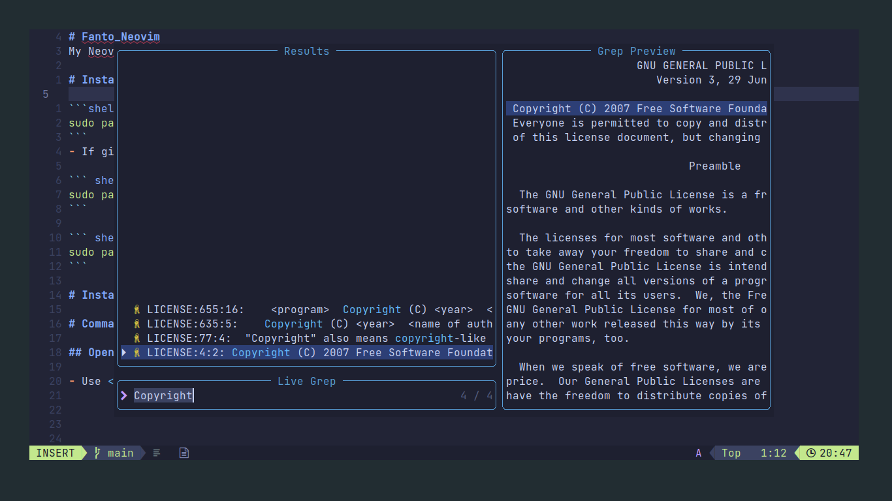
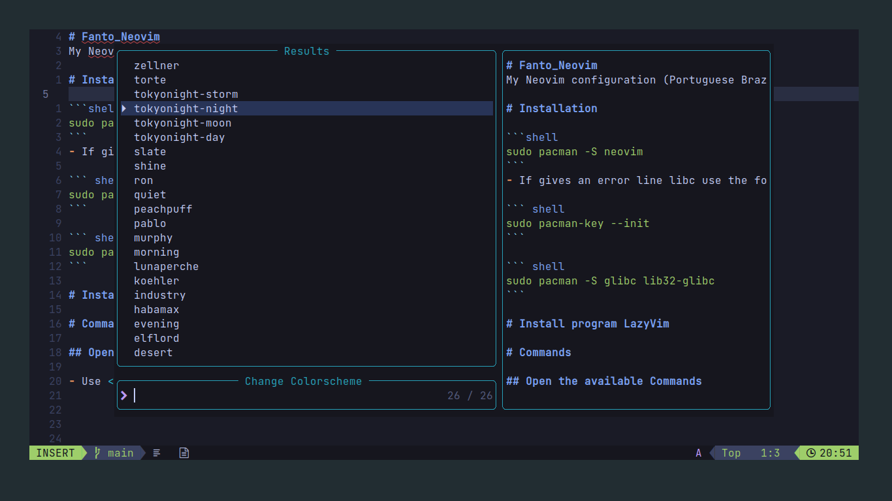
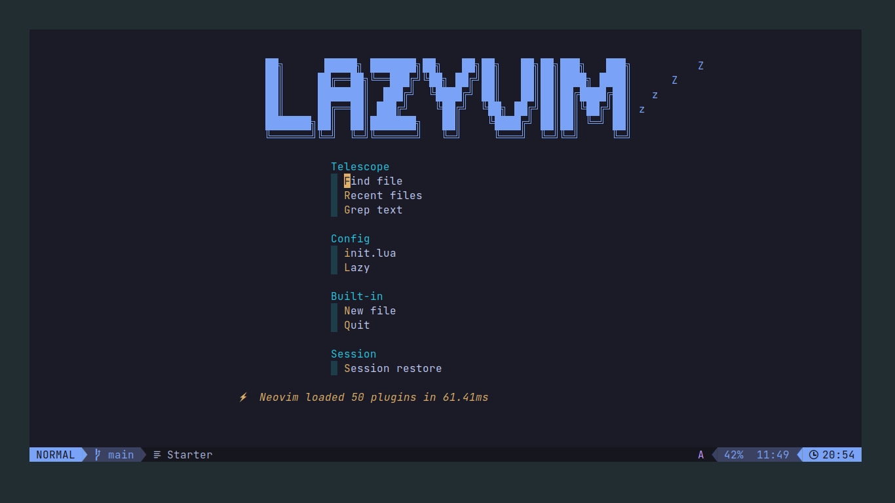

# Fanto_Neovim
My Neovim configuration (Portuguese Brazil)

# Installation

```shell 
sudo pacman -S neovim
```
- If gives an error line libc use the following commands:

``` shell
sudo pacman-key --init
```

``` shell
sudo pacman -S glibc lib32-glibc
```

# Install program LazyVim

- To install LazyVim, just run the following command after installed neovim:

```shell
git clone https://github.com/LazyVim/starter ~/.config/nvim
```

- To remove the `.git` to avoid using the original git repo:

```shell
rm -rf ~/.config/nvim/.git
```

- Now when you start Neovim normally, it's going to open Lazyvim instead and download the already configured plugins.



# Commands

## Open the available Commands

- Use <kbd>Space</kbd> to show all available commands on LazyVim



---

## Open NeoTree

- Neotree is a plugin to show the folders from the current folder you open neovim.
- To activate click on <kbd>Space</kbd> + <kbd>E</kbd> to open neotree.
- Select a folder and click <kbd>Enter</kbd> to open the folder.
- If you click <kbd>Enter</kbd> into a file, it's going to open in neovim.
- You can close neotree just clicking <kbd>Q</kbd> to exit.



---

## Using Mason

- Mason is a package manager to install configs for computer languages in our LazyVim.
- You can access him clicking <kbd>Space</kbd> + <kbd>C</kbd> + <kbd>M</kbd> to open the mason window.



- You can see the names for the packages you can install into lazyvim.
- After you find someone you like, you can install using the command

```shell
# inside lazyvim click in the ":" keyboard to open the command mode
# If you want to install the gh program
MasonInstall gh
```



- After complete, it's going to show that was installed and a popup saying the same:



---

## Using Telescope

- Telescope is a plugin to find files inside neovim.
- To access telescope use the <kbd>Space</kbd> + <kbd>F</kbd> + <kbd>F</kbd> keyboard shortcuts
- It's going to show all text files from the current repository you open neovim.



---

## Using Grep

- grep is a program to find a word into all files from the current directory.
- Need to install into arch linux the `ripgrep` package:

```shell
sudo pacman -S ripgrep
```

- After installed, you can access into lazyvim with <kbd>Space</kbd> + <kbd>S</kbd> + <kbd>G</kbd>.
- You just write the word and grep is going to search in all file from the current directory



---

## Change Colorschemes

- If you want to change the colorscheme use <kbd>Space</kbd> + <kbd>U</kbd> + <kbd>Shift</kbd> + <kbd>C</kbd>
- This is only going to change for the time the Lazyvim is opened, to change permanently is other configuration.






