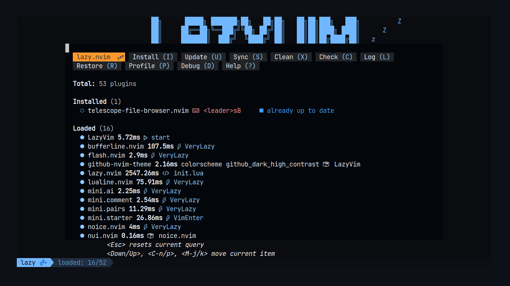

# Fanto_Neovim
My Neovim configuration (Portuguese Brazil)

# Installation

```shell 
sudo pacman -S neovim
```
- If gives an error line libc use the following commands:

``` shell
sudo pacman-key --init
```

``` shell
sudo pacman -S glibc lib32-glibc
```

# Install program LazyVim

- To install LazyVim, just run the following command after installed neovim:

```shell
git clone https://github.com/LazyVim/starter ~/.config/nvim
```

- To remove the `.git` to avoid using the original git repo:

```shell
rm -rf ~/.config/nvim/.git
```

- Now when you start Neovim normally, it's going to open Lazyvim instead and download the already configured plugins.


# FIXES

## Remove lspconfig to startup everytime

- lspconfig need npm installed to work, so everytime you start and show an error on jsonls you can remove that changing the 

# Commands

## Open the available Commands

- Use <kbd>Space</kbd> to show all available commands on LazyVim


---

## Open NeoTree

- Neotree is a plugin to show the folders from the current folder you open neovim.
- To activate click on <kbd>Space</kbd> + <kbd>E</kbd> to open neotree.
- Select a folder and click <kbd>Enter</kbd> to open the folder.
- If you click <kbd>Enter</kbd> into a file, it's going to open in neovim.
- You can close neotree just clicking <kbd>Q</kbd> to exit.


---

## Using Mason

- Mason is a package manager to install configs for computer languages in our LazyVim.
- You can access him clicking <kbd>Space</kbd> + <kbd>C</kbd> + <kbd>M</kbd> to open the mason window.


- You can see the names for the packages you can install into lazyvim.
- After you find someone you like, you can install using the command

```shell
# inside lazyvim click in the ":" keyboard to open the command mode
# If you want to install the gh program
MasonInstall gh
```


- After complete, it's going to show that was installed and a popup saying the same:


---

## Using Telescope

- Telescope is a plugin to find files inside neovim.
- To access telescope use the <kbd>Space</kbd> + <kbd>F</kbd> + <kbd>F</kbd> keyboard shortcuts
- It's going to show all text files from the current repository you open neovim.


---

## Using Grep

- grep is a program to find a word into all files from the current directory.
- Need to install into arch linux the `ripgrep` package:

```shell
sudo pacman -S ripgrep
```

- After installed, you can access into lazyvim with <kbd>Space</kbd> + <kbd>S</kbd> + <kbd>G</kbd>.
- You just write the word and grep is going to search in all file from the current directory


---

## Change Colorschemes

- If you want to change the colorscheme use <kbd>Space</kbd> + <kbd>U</kbd> + <kbd>Shift</kbd> + <kbd>C</kbd>
- This is only going to change for the time the Lazyvim is opened, to change permanently is other configuration.


---

## Split screen

### Create a split

- you can split vertically the screen with <kbd>Space</kbd> + <kbd>|</kbd>
- you can split horizontally the screen with <kbd>Space</kbd> + <kbd>-</kbd>

### Navigate

- If you want to go to the left side, click <kbd>Ctrl</kbd> + <kbd>H</kbd>
- If you want to go to the right side, click <kbd>Ctrl</kbd> + <kbd>L</kbd>
- If you want to go up, click <kbd>Ctrl</kbd> + <kbd>K</kbd>
- If you want to go down, click <kbd>Ctrl</kbd> + <kbd>J</kbd>

#### Change sizes

- You can reordenate the sizes using <kbd>Ctrl</kbd> + <kbd>🡑</kbd><kbd>🡓</kbd><kbd>🡐</kbd><kbd>🡒</kbd>.
- It's going to resize the current split selected.


---

## Access internal terminal

- Using the command <kbd>Space</kbd> + <kbd>F</kbd> + <kbd>T</kbd> you can open a terminal inside lazyvim.


---

# Configure other themes

- We need to create a new file into plugins folder: `~/.config/nvim/lua/plugins`
- This file we are going to call **github.lua**
- Add this lines into the file:

```lua
return {
  {
    "projekt0n/github-nvim-theme",
    lazy = false, -- make sure we load this during startup if it is your main colorscheme
    priority = 1000, -- make sure to load this before all the other start plugins
    config = function()
      require("github-theme").setup({
        -- ...
      })

      vim.cmd("colorscheme github_dark_high_contrast")
    end,
  },
  -- Configure lazyvim to load this colorscheme
  {
    "LazyVim/LazyVim",
    opts = {
      colorscheme = "github_dark_high_contrast",
    },
  },
}
```

- When you save and reopen neovim, it's going to automatically load this lua file


---

# Install new plugins

- We are going to install a new plugin called `telescope-file-browser.nvim`
- First we create a file, I'll show a new way to do this:
    - open neovim
    - open neotree: <kbd>Space</kbd> + <kbd>E</kbd>
    - open the plugins folder and click <kbd>A</kbd> to create a new file


- insert the following code into this new file

```lua
return {
  "nvim-telescope/telescope-file-browser.nvim",
  keys = {
    {
      "<leader>sB", -- <leader> is space, so space + s + B
      ":Telescope file_browser path=%:p:h=%:p:h<cr>",
      desc = "Browse Files",
    },
  },
  config = function()
    require("telescope").load_extension("file_browser")
  end,
}
```


- Save and close neovim
- When you reopen, it's going to install the new plugin



- Now when you click <kbd>Space</kbd> + <kbd>S</kbd> + <kbd>Shift</kbd> + <kbd>B</kbd> it's going to have a better telescope search for files and directories (not the only ones into the current directory).


---

# Customize the logo from lazyvim

- We can change the Lazyvim logo to something more customized using the `alpha-nvim` plugin.
- First we create a new plugin file called `alpha.lua` into plugin directory.
- Insert this code into the file.

```lua
return {
    "goolord/alpha-nvim", -- official lazyvim plugin
    enable = true, -- activate this plugin into lazyvim
    opts = function(_, opts)
        local logo = [[
             ______            __             _         
            / ____/___ _____  / /_____ _   __(_)___ ___ 
           / /_  / __ `/ __ \/ __/ __ \ | / / / __ `__ \
          / __/ / /_/ / / / / /_/ /_/ / |/ / / / / / / /
         /_/    \__,_/_/ /_/\__/\____/|___/_/_/ /_/ /_/ 
                                               
                    [FANTO IDE INTO TERMINAL]
        ]]
        opts.section.header.val = vim.split(logo, "\n", {  trimempty = true })
        end,
}
```

